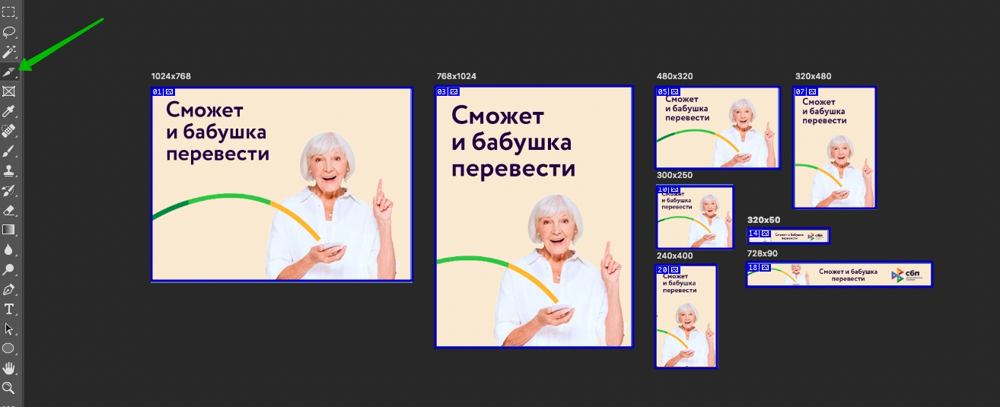
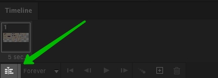
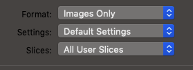

# Gif generator

Photoshop plugin, that creates Gif from artboars's layers.

### Installing

Move .jsx file to Photoshop's script directory.

Example for macOS: /Applications/Adobe Photoshop CC 2020/Presets/Scripts

Restart Photoshop then go to File > Script to access.

## Getting Started

1. Create layout with or without artboards;
2. Place layers one after another (from first to last Gif frame);
3. Slice every artboard along the contour by Slice Tool; 

4. Convert frames to Video Timeline; 

5. Change export preferences in Save for Web > Save and save it; 

6. Start script and follow instructions.

## Authors

* Leo Nardo
